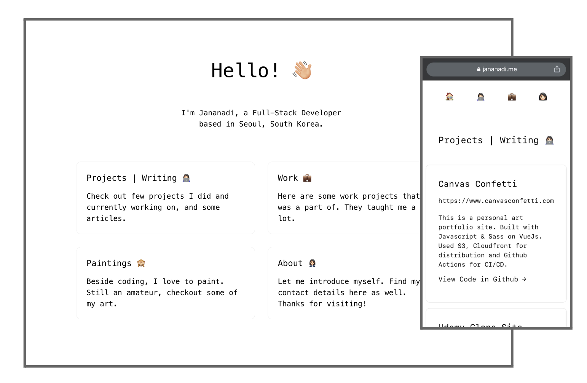

## Portfolio Website
A simple personal portfolio website to showcase and organize important personal and work projects all in one place.



## Features
- Localization KR, EN
- Dark/Light Mode

## Build Setup
```bash
npm i

npm run dev
# or
yarn dev
```

Open [http://localhost:3000](http://localhost:3000) with your browser to see the result.

## Directory Structure
```js
.
├── components // all React Components can be used in layouts, pages
│   ├── navbar
│   ├── header
├── pages // route pages
|   ├── about // about page
│   │   ├── index.tsx
│   ├── _app.tsx // error page
│   ├── index.tsx // home/index page
├── public // static imgs etc.
└── styles
```

## Deploy on Vercel
Commit and push changes to deploy on Vercel.
